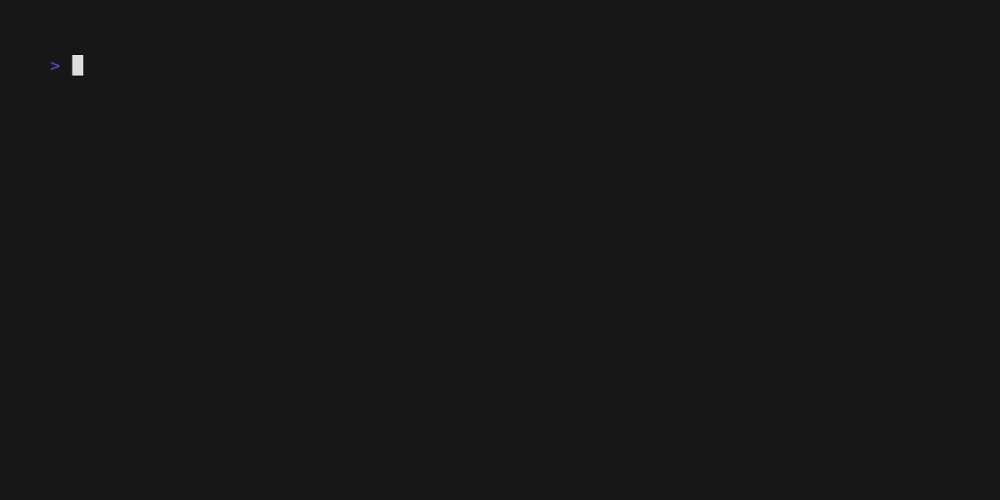

[[_TOC_]]
# About mkcli

mkcli is a command-line interface (CLI) tool designed to manage CF Kubernetes clusters and their associated resources. It provides a user-friendly way to interact with Kubernetes clusters, allowing users to perform operations such as creating, updating, and deleting clusters, managing node pools, and handling authentication contexts.


# Installation
### Prerequisites
1. Python 3.12 or higher
2. [pipx](https://pipx.pypa.io/stable/#on-linux)

### Installation
mkcli can be installed using pipx. To install mkcli, run the following command:

```bash
pipx install git+https://github.com/CloudFerro/cf-mkcli.git
```
> [!NOTE]
> pipx will install mkcli in a default location, which is usually `/root/.local/bin`. Don't forget to add
> this directory to your `PATH` environment variable if it is not already included. You can do it automatically
> by using `pipx ensurepath` command and restarting your terminal.

Now you can run it just with:
```bash
mkcli
```
or
```bash
python -m mkcli
```

# Usage Guide
Remember, that you can always have a look at commandline help:
```commandline
mkcli --help
```

## Authorization
To start using `mkcli`, you need to authorize it with your credentials. In the simplest way this can be done by running the following command:
```commandline
mkcli auth init
```
`mkcli` will prompt you to enter `realm` and `region` names, which are required to connect to your account.
and then you can check if you are logged in by running:,
```commandline
mkcli auth token show
```
How does it work? `mkcli` will open web browser window and ask you to log in to your account.
After successful logging in, `mkcli` will "remember" your credentials and you can use it without logging in again
for certain amount of time.

If you want to log out, anc clear all saved auth session data, you can run:
```commandline
mkcli auth end
```
and it will purge all saved credentials and tokens, so you will need to run `mkcli auth init` again to log in.


### *Advanced: Auth contexts (you can skip this part of docs if you are not interested in advanced usage)*
_*Optionally_: If you want to use `mkcli` simultaneously for different accounts, or in different realms,
you can use "login session contexts" feature.
This allows you to create multiple contexts, each with its own credentials and settings.
```commandline
mkcli auth context add {context-name}
```
This command will prompt you to add all needed information, for creating a new context (e.g., realm, client ID, client secret, etc.).
But don't worry if you are not familiar with all of them, since mkcli provides default values for most of the fields.
You can always list, edit, duplicate or delete contexts (see help for `mkcli auth context` command).

To switch between contexts, you can use:
```commandline
mkcli auth context switch {context-name}
```
If you want, you can also list, edit, duplicate or delete contexts (see help for `mkcli auth context` command).



### Simple usage examples just for starting up
Here you can find a several examples of how to use the mkcli tool.

### List all clusters
You can list all your clusters by running:
```commandline
mkcli cluster list
```
To increase readability you can easily filter the output by using `jq` command. For example, to list only cluster IDs, names and statuses, you can run:
```commandline
mkcli cluster list --format json | jq '.items[] | {id, name, status}'```
```
### List all available flavors
```commandline
mkcli flavor list
```
You should see a list of all available flavors in your region.
By default, you should see an output formatted as table. If you want to see it in JSON format,
you can use the `--format` option:
```commandline
mkcli flavors list --format json
```

### Create a new cluster

# mkcli reference documentation

mkcli - A CLI for managing your Kubernetes clusters

**Usage**:

```console
$ [OPTIONS] COMMAND [ARGS]...
```

**Options**:

* `--verbose / --no-verbose`: [default: no-verbose]
* `--install-completion`: Install completion for the current shell.
* `--show-completion`: Show completion for the current shell, to copy it or customize the installation.
* `--help`: Show this message and exit.

**Commands**:

* `auth`: mkcli authorization and authentication...
* `cluster`: Manage Kubernetes clusters
* `node-pool`: Manage Kubernetes cluster&#x27;s node pools
* `kubernetes-version`: Manage Kubernetes versions
* `flavors`: Manage Kubernetes machine specs (flavors)
* `regions`: Manage regions

## `auth`

mkcli authorization and authentication management

**Usage**:

```console
$ auth [OPTIONS] COMMAND [ARGS]...
```

**Options**:

* `--help`: Show this message and exit.

**Commands**:

* `init`: Initialize authentication session
* `end`: End authentication session and clear saved...
* `token`: Authorization token management
* `context`: Manage authentication contexts

### `auth init`

Initialize authentication session

**Usage**:

```console
$ auth init [OPTIONS]
```

**Options**:

* `--realm TEXT`: Realm name  [default: Creodias-new]
* `--region TEXT`: Region name  [default: WAW4-1]
* `--help`: Show this message and exit.

### `auth end`

End authentication session and clear saved tokens

**Usage**:

```console
$ auth end [OPTIONS]
```

**Options**:

* `--help`: Show this message and exit.

### `auth token`

Authorization token management

**Usage**:

```console
$ auth token [OPTIONS] COMMAND [ARGS]...
```

**Options**:

* `--help`: Show this message and exit.

**Commands**:

* `clear`: Clear the current access token from the...
* `refresh`: Refresh the current access token from the...
* `show`: Show the current access token from the...

#### `auth token clear`

Clear the current access token from the authorization session (current context)

**Usage**:

```console
$ auth token clear [OPTIONS]
```

**Options**:

* `--help`: Show this message and exit.

#### `auth token refresh`

Refresh the current access token from the authorization session (current context)

**Usage**:

```console
$ auth token refresh [OPTIONS]
```

**Options**:

* `--help`: Show this message and exit.

#### `auth token show`

Show the current access token from the authorization session (current context)

**Usage**:

```console
$ auth token show [OPTIONS]
```

**Options**:

* `--help`: Show this message and exit.

### `auth context`

Manage authentication contexts

**Usage**:

```console
$ auth context [OPTIONS] COMMAND [ARGS]...
```

**Options**:

* `--help`: Show this message and exit.

**Commands**:

* `show`: Show current auth context
* `list`: Remove given auth context from the catalogue
* `add`: Prompt for new auth context and add it to...
* `delete`: emove given auth context from the catalogue
* `duplicate`: Duplicate given auth context with a new name
* `edit`: Update given auth context
* `switch`: Switch to a different auth context

#### `auth context show`

Show current auth context

**Usage**:

```console
$ auth context show [OPTIONS]
```

**Options**:

* `-f, --format [table|json]`: [default: table]
* `--help`: Show this message and exit.

#### `auth context list`

Remove given auth context from the catalogue

**Usage**:

```console
$ auth context list [OPTIONS]
```

**Options**:

* `-f, --format [table|json]`: [default: table]
* `--help`: Show this message and exit.

#### `auth context add`

Prompt for new auth context and add it to the catalogue

**Usage**:

```console
$ auth context add [OPTIONS] NAME
```

**Arguments**:

* `NAME`: [required]

**Options**:

* `--client-id TEXT`: Client ID for the new auth context  [default: managed-kubernetes]
* `--realm TEXT`: Realm for the new auth context  [default: Creodias-new]
* `--scope TEXT`: Scope for the new auth context  [default: email profile openid]
* `--region TEXT`: Region for the new auth context  [default: WAW4-1]
* `--identity-server TEXT`: Identity server URL for the new auth context  [default: https://identity.cloudferro.com/auth/]
* `--help`: Show this message and exit.

#### `auth context delete`

emove given auth context from the catalogue

**Usage**:

```console
$ auth context delete [OPTIONS] NAMES...
```

**Arguments**:

* `NAMES...`: Names of the auth context to delete  [required]

**Options**:

* `-y, --confirm`
* `--help`: Show this message and exit.

#### `auth context duplicate`

Duplicate given auth context with a new name

**Usage**:

```console
$ auth context duplicate [OPTIONS] CTX
```

**Arguments**:

* `CTX`: Name of the auth context to duplicate  [required]

**Options**:

* `-n, --name TEXT`: Name for the new auth context  [required]
* `--help`: Show this message and exit.

#### `auth context edit`

Update given auth context

**Usage**:

```console
$ auth context edit [OPTIONS] CTX
```

**Arguments**:

* `CTX`: Name of the auth context to update  [required]

**Options**:

* `-n, --name TEXT`: Name for the new auth context
* `--client_id TEXT`: Client ID for the new auth context
* `--realm TEXT`: Realm for the new auth context
* `--scope TEXT`: Scope for the new auth context
* `--region TEXT`: Region for the new auth context
* `--identity_server TEXT`: Identity server URL for the new auth context
* `--help`: Show this message and exit.

#### `auth context switch`

Switch to a different auth context

**Usage**:

```console
$ auth context switch [OPTIONS] CTX
```

**Arguments**:

* `CTX`: Name of the auth context to set as current  [required]

**Options**:

* `--help`: Show this message and exit.

## `cluster`

Manage Kubernetes clusters

**Usage**:

```console
$ cluster [OPTIONS] COMMAND [ARGS]...
```

**Options**:

* `--help`: Show this message and exit.

**Commands**:

* `create`: Create a new k8s cluster
* `update`: Update the cluster with given id
* `delete`: Delete the cluster with given id
* `list`: List all clusters
* `show`: Show cluster details
* `get-kubeconfig`: Download kube-config.yaml for the cluster

### `cluster create`

Create a new k8s cluster

**Usage**:

```console
$ cluster create [OPTIONS]
```

**Options**:

* `--name TEXT`: Cluster name, if None, generate with petname
* `--kubernetes-version TEXT`: Kubernetes version, if None, use default  [default: 1.30.10]
* `--master-count INTEGER`: Number of master nodes, if None, use default  [default: 3]
* `--master-flavor TEXT`: Master node flavor name, if None, use default  [default: hma.medium]
* `--from-json FROM_JSON`: Cluster payload in JSON format, if None, use provided options
* `--dry-run`: If True, do not perform any actions, just print the payload
* `--help`: Show this message and exit.

### `cluster update`

Update the cluster with given id

**Usage**:

```console
$ cluster update [OPTIONS] CLUSTER_ID
```

**Arguments**:

* `CLUSTER_ID`: Cluster ID  [required]

**Options**:

* `--kubernetes-version TEXT`: Kubernetes version, if None, use default
* `--master-count INTEGER`: Number of master nodes, if None, use default
* `--master-flavor TEXT`: Master node flavor name, if None, use default
* `--dry-run`: If True, do not perform any actions, just print the payload
* `--help`: Show this message and exit.

### `cluster delete`

Delete the cluster with given id

**Usage**:

```console
$ cluster delete [OPTIONS] CLUSTER_ID
```

**Arguments**:

* `CLUSTER_ID`: Cluster ID  [required]

**Options**:

* `-y, --confirm`
* `--dry-run`: If True, do not perform any actions, just print the payload
* `--help`: Show this message and exit.

### `cluster list`

List all clusters

**Usage**:

```console
$ cluster list [OPTIONS]
```

**Options**:

* `--format [table|json]`: Output format, either &#x27;table&#x27; or &#x27;json&#x27;  [default: table]
* `--help`: Show this message and exit.

### `cluster show`

Show cluster details

**Usage**:

```console
$ cluster show [OPTIONS] CLUSTER_ID
```

**Arguments**:

* `CLUSTER_ID`: Cluster ID  [required]

**Options**:

* `--help`: Show this message and exit.

### `cluster get-kubeconfig`

Download kube-config.yaml for the cluster

**Usage**:

```console
$ cluster get-kubeconfig [OPTIONS] CLUSTER_ID
```

**Arguments**:

* `CLUSTER_ID`: Cluster ID  [required]

**Options**:

* `--output TEXT`: Output file for kube-config, default is &#x27;kube-config.yaml&#x27;  [default: kube-config.yaml]
* `--dry-run`: If True, do not perform any actions, just print the payload
* `--help`: Show this message and exit.

## `node-pool`

Manage Kubernetes cluster&#x27;s node pools

**Usage**:

```console
$ node-pool [OPTIONS] COMMAND [ARGS]...
```

**Options**:

* `--help`: Show this message and exit.

**Commands**:

* `create`: Create a new node pool
* `list`: List all node pools in the cluster
* `update`: Update the node pool with given id
* `show`
* `delete`: Delete a node pool

### `node-pool create`

Create a new node pool

**Usage**:

```console
$ node-pool create [OPTIONS] CLUSTER_ID
```

**Arguments**:

* `CLUSTER_ID`: Cluster ID  [required]

**Options**:

* `--flavor TEXT`: Machine flavor for the node pool, if None, use the default flavor  [required]
* `--name TEXT`: Node pool name, if None, generate with petname  [required]
* `--node-count INTEGER`: Number of nodes in the pool  [default: 0]
* `--min-nodes INTEGER`: Minimum number of nodes in the pool  [default: 0]
* `--max-nodes INTEGER`: Maximum number of nodes in the pool  [default: 0]
* `--shared-networks TEXT`: List of shared networks for the node pool
* `--autoscale / --no-autoscale`: Enable autoscaling for the node pool  [default: no-autoscale]
* `--from-json FROM_JSON`: Node-pool payload in JSON format, if None, use provided options
* `--dry-run`: If True, do not perform any actions, just print the payload
* `--help`: Show this message and exit.

### `node-pool list`

List all node pools in the cluster

**Usage**:

```console
$ node-pool list [OPTIONS] CLUSTER_ID
```

**Arguments**:

* `CLUSTER_ID`: Cluster ID to operate on  [required]

**Options**:

* `--format [table|json]`: Output format, either &#x27;table&#x27; or &#x27;json&#x27;  [default: table]
* `--help`: Show this message and exit.

### `node-pool update`

Update the node pool with given id

**Usage**:

```console
$ node-pool update [OPTIONS] CLUSTER_ID NODE_POOL_ID
```

**Arguments**:

* `CLUSTER_ID`: Cluster ID  [required]
* `NODE_POOL_ID`: Node Pool ID to update  [required]

**Options**:

* `--node-count INTEGER`: Number of nodes in the pool
* `--min-nodes INTEGER`: Minimum number of nodes in the pool
* `--max-nodes INTEGER`: Maximum number of nodes in the pool
* `--shared-networks TEXT`: List of shared networks for the node pool
* `--autoscale / --no-autoscale`: Enable autoscaling for the node pool
* `--dry-run`: If True, do not perform any actions, just print the payload
* `--help`: Show this message and exit.

### `node-pool show`

**Usage**:

```console
$ node-pool show [OPTIONS] CLUSTER_ID NODE_POOL_ID
```

**Arguments**:

* `CLUSTER_ID`: Cluster ID to operate on  [required]
* `NODE_POOL_ID`: Node pool ID to operate on  [required]

**Options**:

* `--help`: Show this message and exit.

### `node-pool delete`

Delete a node pool

**Usage**:

```console
$ node-pool delete [OPTIONS] CLUSTER_ID NODE_POOL_ID
```

**Arguments**:

* `CLUSTER_ID`: Cluster ID to operate on  [required]
* `NODE_POOL_ID`: Node pool ID to operate on  [required]

**Options**:

* `-y, --confirm`
* `--dry-run`: If True, do not perform any actions, just print the payload
* `--help`: Show this message and exit.

## `kubernetes-version`

Manage Kubernetes versions

**Usage**:

```console
$ kubernetes-version [OPTIONS] COMMAND [ARGS]...
```

**Options**:

* `--help`: Show this message and exit.

**Commands**:

* `list`: List all Kubernetes versions

### `kubernetes-version list`

List all Kubernetes versions

**Usage**:

```console
$ kubernetes-version list [OPTIONS]
```

**Options**:

* `--format [table|json]`: Output format, either &#x27;table&#x27; or &#x27;json&#x27;  [default: table]
* `--help`: Show this message and exit.

## `flavors`

Manage Kubernetes machine specs (flavors)

**Usage**:

```console
$ flavors [OPTIONS] COMMAND [ARGS]...
```

**Options**:

* `--help`: Show this message and exit.

**Commands**:

* `list`: List all available flavors

### `flavors list`

List all available flavors

**Usage**:

```console
$ flavors list [OPTIONS]
```

**Options**:

* `--format [table|json]`: Output format, either &#x27;table&#x27; or &#x27;json&#x27;  [default: table]
* `--help`: Show this message and exit.

## `regions`

Manage regions

**Usage**:

```console
$ regions [OPTIONS] COMMAND [ARGS]...
```

**Options**:

* `--help`: Show this message and exit.

**Commands**:

* `list`: List all available regions

### `regions list`

List all available regions

**Usage**:

```console
$ regions list [OPTIONS]
```

**Options**:

* `--format [table|json]`: Output format, either &#x27;table&#x27; or &#x27;json&#x27;  [default: table]
* `--help`: Show this message and exit.
